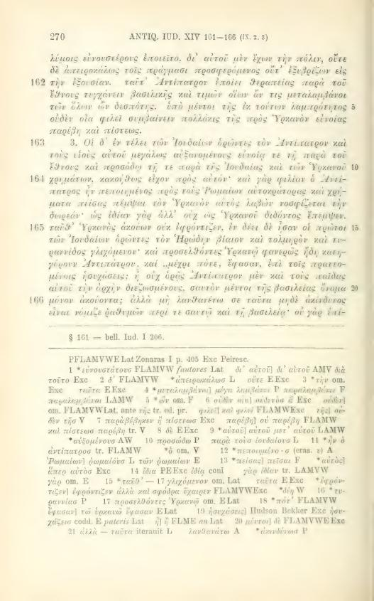
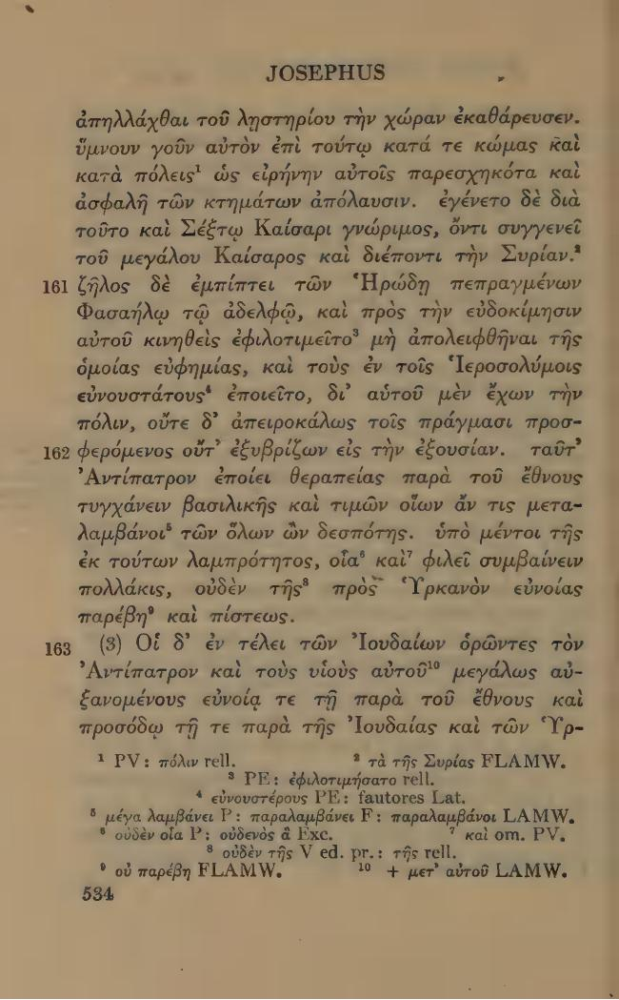

# XIV.162 — exact cut in difficult preserved syntax

Recommendation: **A, immediately before `antipatrum, faciebat`**. This gives 162 its earliest explicit Antipater counterpart. The difficult preceding `tractaretque` remains in 161. Record the syntax limitation separately from the placement decision.

Greek 161 describes Phasael’s conduct toward Jerusalem and public affairs. Greek 162 says these events brought Antipater royal honours; it then says his success did not impair his loyalty to Hyrcanus. The Latin reads:

> ... et ierosolimi tas fauores sibi parabat, dum et ciuitatem haberet et populi negotia non ignoraret, tractaretque antipatrum, faciebat ab omni gente tamquam esset omnium dominus, honorari tamen ex tali claritate qualia saepius contingunt, hyrcani fidem transgressus est.

| Choice | Exact start of 162 | Effect |
|---|---|---|
| **A** | `antipatrum, faciebat` | Starts at the first Antipater counterpart. Leaves the difficult `tractaretque` as the preceding tail. |
| B | `faciebat ab omni gente` | Starts at the honours predicate; leaves the Antipater name with 161. |
| C | `tractaretque antipatrum` | Keeps the difficult verb/object sequence together, but takes the prior action word into 162. |

The Latin’s punctuation and wording remain unchanged under every choice. In particular, no replacement with `tractaret. quae antipatrum` is proposed, and `transgressus est` remains even though Greek denies disloyalty. This is surviving correspondence with a wording/syntax difference, not an absence.

Exact raw-byte, text/tail-node and Unicode locators, and the resulting complete intervals through the start of 163, are in [DECISION_XIV_162.json](DECISION_XIV_162.json). Greek identity and the shift to Antipater are independently confirmed by the inspected print:

No Latin cut for 162 has been adopted. All independent XIV and XV work may continue.
