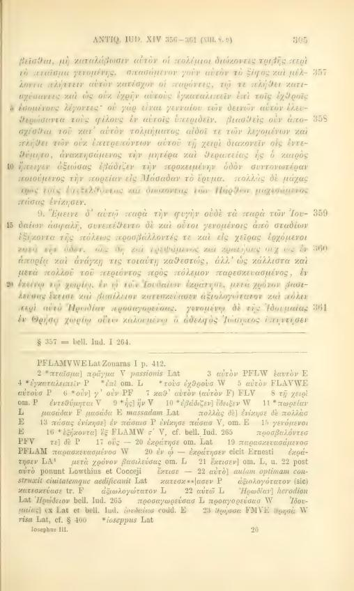
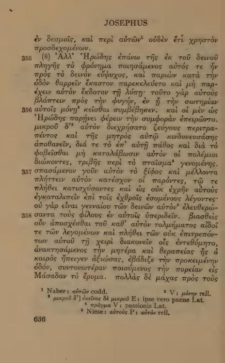
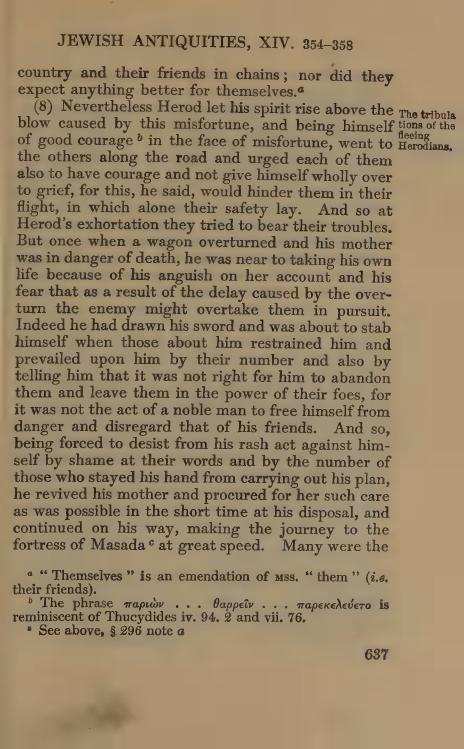

# XIV.358 — transmitted interruption and alternative cuts

Recommendation: **A, before Quibus uerbis compulsus**. Greek357 gives the moral appeal against abandoning friends; Greek358 begins the compulsion to abandon Herod's attempted suicide, then care of his mother and the journey. The Latin transmits:

> Nam non hoc esse fortis siquidem, sed e peri Quibus uerbis compulsus facinus quod in se culis liberans, amatos traderet inimicis. cognitauerat pretermisit, matremque curans ...

The wording is interrupted: `e peri` and `culis liberans, amatos traderet inimicis` express material corresponding to357, while `Quibus uerbis compulsus facinus quod in se` and `cognitauerat pretermisit` express358. The cause is not established. No relocation, reconstructed wording or textual correction is proposed.

| Choice | Exact cut | Consequence |
|---|---|---|
| **A** | before `Quibus uerbis compulsus` | Starts358 at its first explicit counterpart; the displaced357 moral tail remains physically inside358. Requires reciprocal correspondence notes. |
| B | before `cognitauerat pretermisit` | Keeps the moral tail in357, while leaving the preceding358 compulsion/object wording in357 and separating it from its predicate. |
| C | before `matremque curans` | Starts358 at care of the mother; all preceding compulsion/abandonment wording corresponding to358 remains in357. |

Every option ends358 before the verified start of359, `In fuga uero nec`. Exact alternatives, Unicode/text-tail/raw UTF8 locators and both resulting intervals are in [DECISION_XIV_358.json](DECISION_XIV_358.json). Partial displaced correspondence must stay separate from confidence in any approved physical placement;358 is not absent.

Inspected primary: Niese III (1892), p305/PDF377. Inspected independent control: Loeb VII Greek p636/PDF648 and English p637/PDF649. Both place the compulsion at358's opening, but neither resolves ownership of the interposed Latin fragments.

## User decision, 2026-10-09

A approved at the exact frozen locator. B and C rejected for the recorded reasons. Adjoining357–359 intervals recomputed through360 and independently validated.

XIV.357: Partial/reordered correspondence: closing material of Greek XIV.357 survives physically within the following Latin interval, at culis liberans, amatos traderet inimicis, completing the interrupted peri … culis. See XIV.358. The surviving tail is not absent; no cause of the disorder is inferred.

XIV.358: Partial/reordered correspondence: the first surviving counterpart of Greek XIV.358 begins Quibus uerbis compulsus facinus quod in se. It is interrupted by culis liberans, amatos traderet inimicis, the surviving closing material of XIV.357 completing peri … culis. XIV.358’s own construction resumes at cognitauerat pretermisit. This Latin interval includes displaced357 material and supplies only partial correspondence to358; wording has not been joined or moved.
