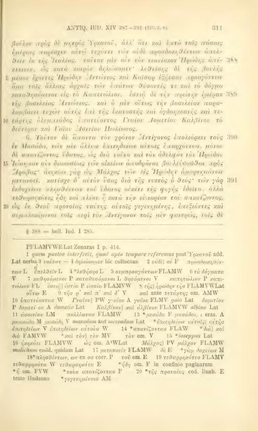
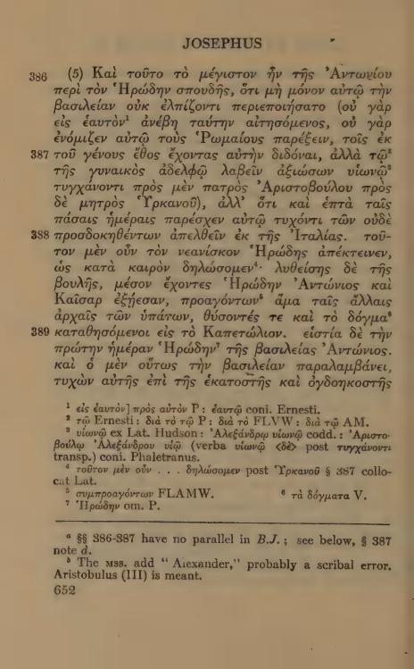
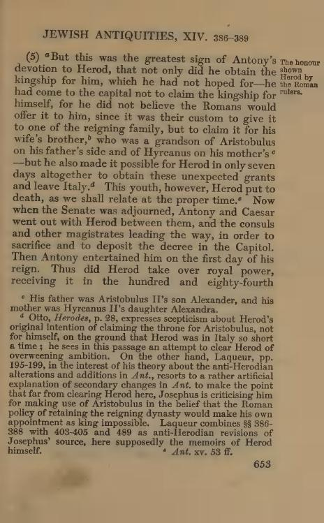

# XIV.388 — death reference before the seven-day clause

Recommendation: **B, before senatu uero dimisso**. Greek387 gives the request for the wife brother and the seven-day grant; Greek388 gives the later death reference, then the senate dismissal and Capitol procession. Latin places the death reference before the seven-day clause:

> et ideo fratri sui uxoris id praeberi uolebat, qui nepos per patrem quidem aristoboli per matrem uero hyrcani fuerat quem postea interfecit, quod apto tempore referemus. Sed cum intra septimum diem contulisset ei senatus quod nullatenus sperauit, et ab italia discedere fecisset, senatu uero dimisso, herodem medium habentes, antonius et caesar exierunt.

| Option | Exact start388 | Consequences |
|---|---|---|
| A | before quem postea interfecit | Earliest388 counterpart, but the intervening seven-day grant belonging to387 remains inside388. |
| **B** | before senatu uero dimisso | Continuous dismissal/procession starts388. Death reference corresponding to388 remains in387; reciprocal notes explain this displacement. |
| C | before Sed cum intra septimum diem | Death reference stays387, but starts388 with material corresponding to387. |

No option changes words, punctuation, whitespace or markup. None is whole-section absence. Both intervals are qualified for reordering. Every alternative ends388 before verified389, herodem autem primo die. Exact Unicode/node/raw UTF8 locators and resulting387/388 intervals are in [DECISION_XIV_388.json](DECISION_XIV_388.json). Placement confidence and correspondence completeness remain separate.

Inspected Niese III p310–311/PDF382–383 and independent Loeb VII Greek p652/PDF664 and English p653/PDF665 establish the different order.

