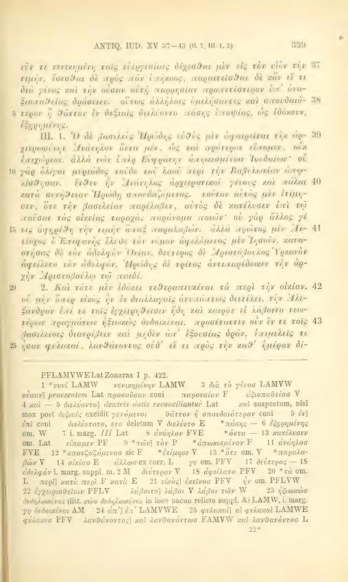
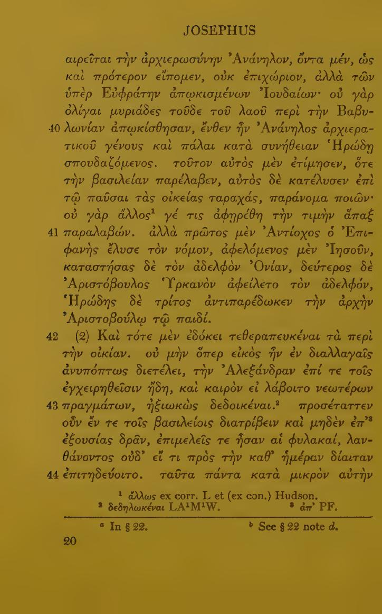
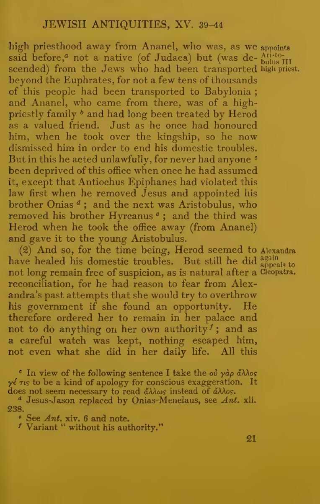

# XV.40 — decision required

Recommendation: **B, before `seditiones domesticas pacando`**. This preserves the complete removal statement in XV.39 and gives XV.40 the surviving domestic motive and legal prohibition. Disclose that `praeter legem` anticipates Greek 40 while remaining in the Latin interval for 39.

Greek 39 removes Ananel and describes his Babylonian origins. Greek 40 continues his origin, lineage, previous favour and appointment, then describes his removal to end domestic trouble, its illegality and the prohibition against removing an incumbent. Latin compresses those details into:

> Itaque rex herodes statim principatu sacerdotii anandum praeter legem exuit, seditiones domesticas pacando, nam non licebat aliquem honore semel accepto fraudari, quod prius antiochus epifanis destruxit ...

| Choice | Exact start of 40 | Effect on 39 and 40 |
|---|---|---|
| A | `praeter legem exuit` | Takes the first legality counterpart into 40, but separates 39's object from its verb `exuit`. |
| **B** | `seditiones domesticas pacando` | Keeps 39's removal predicate intact; 40 contains motive and prohibition. Qualify the anticipatory legality phrase in 39. |
| C | `nam non licebat` | Gives 40 only the prohibition; leaves the motive and legality phrase in 39. |

All choices end 40 before `quod prius antiochus`, the independently supported beginning of 41. Full node/Unicode/raw-byte locators and both resulting extents are in [DECISION_XV_040.json](DECISION_XV_040.json). No change has been adopted for 40.

Both printed controls were visually inspected: Niese III (1892), p.339 / PDF411, and Loeb VIII, Greek p.20 / PDF36 and English p.21 / PDF37. The marginal numeral locates the section; it does not resolve the reordered Latin cut.

The transcription has surviving correspondence for 40. Whole-section absence is unsupported. No missing wording is supplied, and no physical loss or statement about the entire Latin tradition is inferred.
